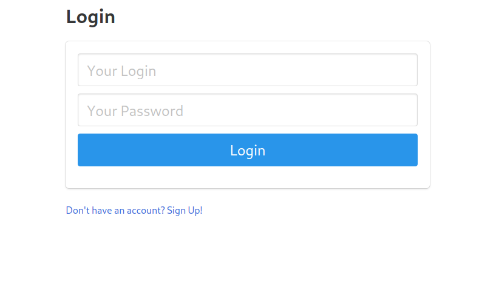
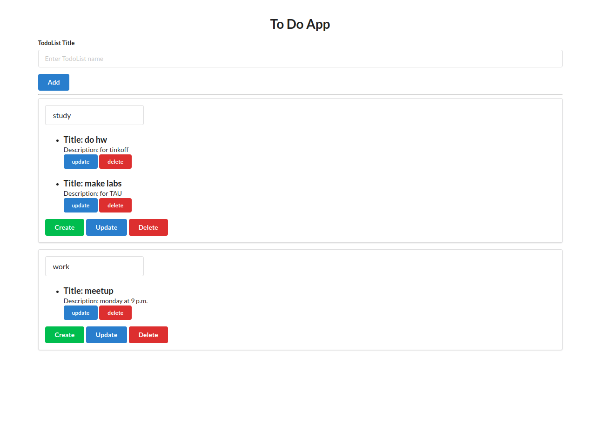

Разработать todo list, имеющий шаблонизатор и API

Общие требования:

- Пользователь может просмотреть/создать/изменить/удалить список задач
- Пользователь может просмотреть/создать/изменить/удалить задачу в списке
- Данные должны сохраняться в реляционной БД и быть доступны между запусками приложения
- Не использовать фреймворки (обойтись wsgi/asgi, gunicorn/uvicorn)
- Приложение должно содержать 2 роли: админ, пользователь
- Админ может просматривать записи других пользователей
- Пользователь не должен иметь доступа к другим спискам/задачам
- Пароли должны быть захэшированы
- Организовать защиту от XSS атак
- Приложение проходит проверки flake8-bandit
- Приложение должно быть протестировано (иметь покрытие >= 95%)
- Приложение и БД должны запускаться в docker-compose
- Организовать тесты и проверку flake8-bandit в CI

Требования к части, предоставляющей HTML:

 - Доступ должен осуществляться через токены сессии
 - POST запросы должны подтверждаться через CSRF токены

Требования к части, предоставляющей API:

 - Доступ должен осуществляться через JWT токены

Доступ к html страницам должен осуществляться с токеном сессии, к API через JWT токен

-------------------

Я сделал с разделением на бэк и фронт.
Как выглядит фронт: (знаю, что плохо, я не фронтендер 😔)     

     

     

### Как запустить?

```
git clone https://github.com/d0ggzi/todo-project    
cd todo-project    
docker-compose up    
```

